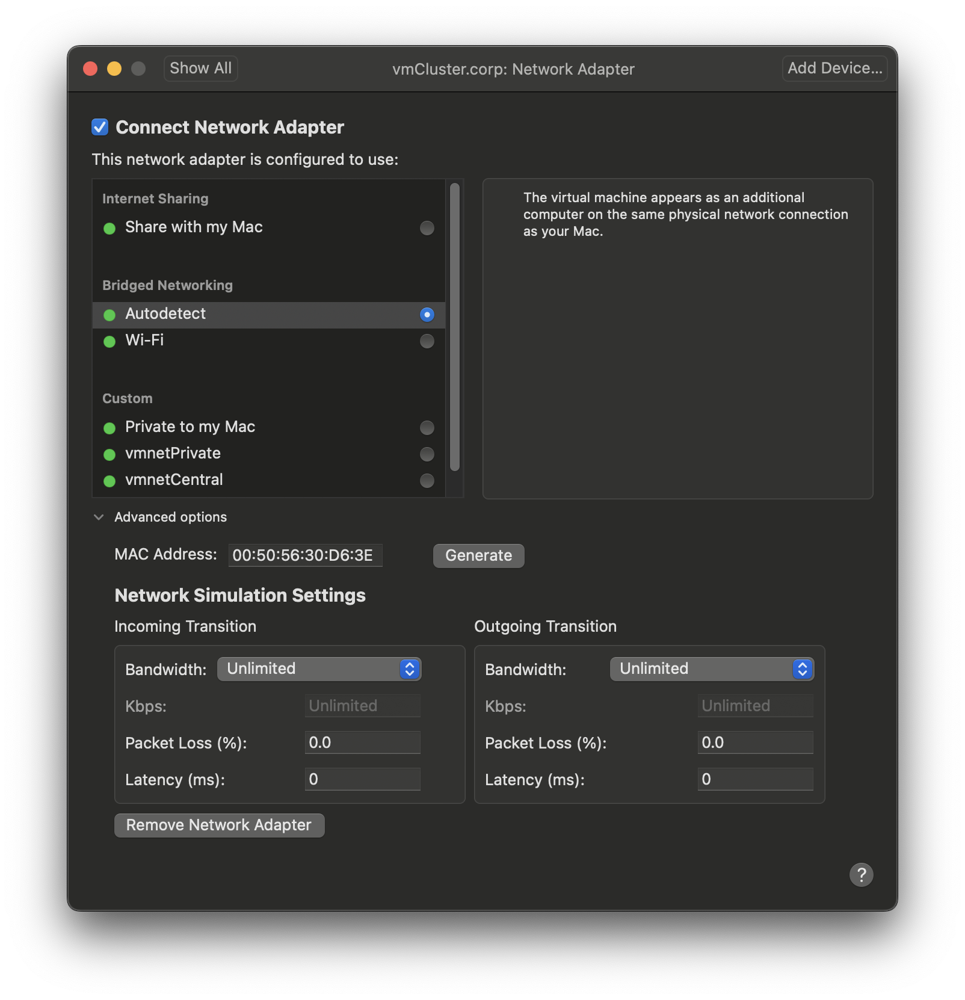
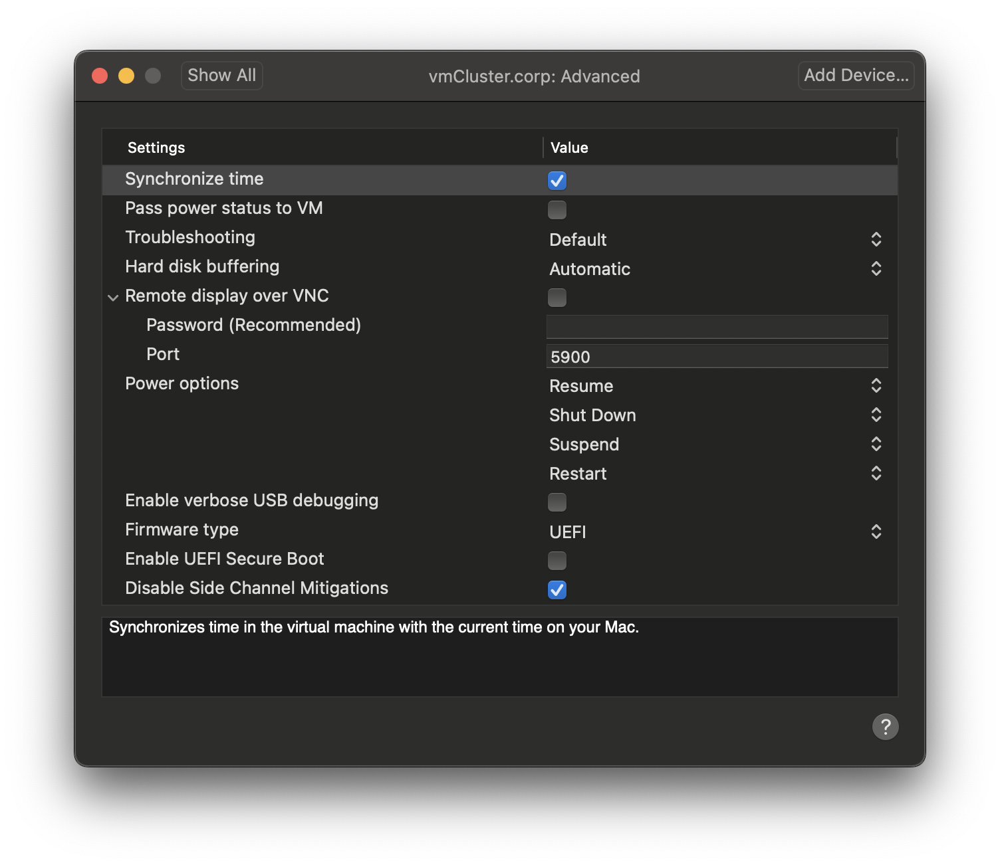

# Virtualized Cluster Environment

This recipe outlines how to setup VMware Fusion and a virtual frontend-node. The following screenshots were taken from VMware Fusion Professional v13.6.2.

Create a custom local network (via `Settings -> Network`), which is fully decoupled from the computer on which VMware is running. The subnet address is assigned when the settings are saved. In this case the subnet is `172.16.79.0` with netmask `255.255.255.0` and with name `vmnetRocky`.

Create a new custom virtual machine for **Rocky Linux 64-bit**, call it `vmCluster.corp` and create via `Add Device...` a second network adapter as well as (in this case) 7 addtional hard disks. The additional disks are somewhat optional, but will be used later to setup a tailored LVM/RAID configuration with a good balance in data redundancy and disk space extensibility.

For this virtualized frontend-node each disk may have the following settings. They will (when configured as SATA-drives) appear later as `/dev/sda` to `/dev/sgh`. The disk size of 1TB is chosen somewhat arbitrarily, but **all** disks must have the same size and bus type. Check that the first (preconfigured) hard disk matches to the 7 added new disks.

Adjust processor and RAM settings for the frontend-node. All settings can be tweaked later, when the virtual machine is switched off.

Adjust the settings of the public network interface (`Network Adapter`). In particular, generate a new MAC address.

Adjust the settings on the private Ethernet interface (`Network Adapter 2`). Select the previously defined private subnet `vmnetRocky` for this interface and generate a new unique MAC-address.

Make some adjustments in the `Advanced` section. Notice the selected UEFI firmware type.

Download the latest Rocky Linux 9.5 boot image file (https://download.rockylinux.org/pub/rocky/9/isos/x86_64/Rocky-9.5-x86_64-boot.iso), load it into the virtual CD/DVD drive and connect the drive.

Select the CD/DVD drive as start start-up disk and click `Restart`.

The virtual machine boots from the connected boot image and the Rocky Linux Installer takes command. Continue with the next recipe [Base Operation System Setup on Frontend Node](./02-Base-Operation-System-Setup-on-Frontend-Node.md).