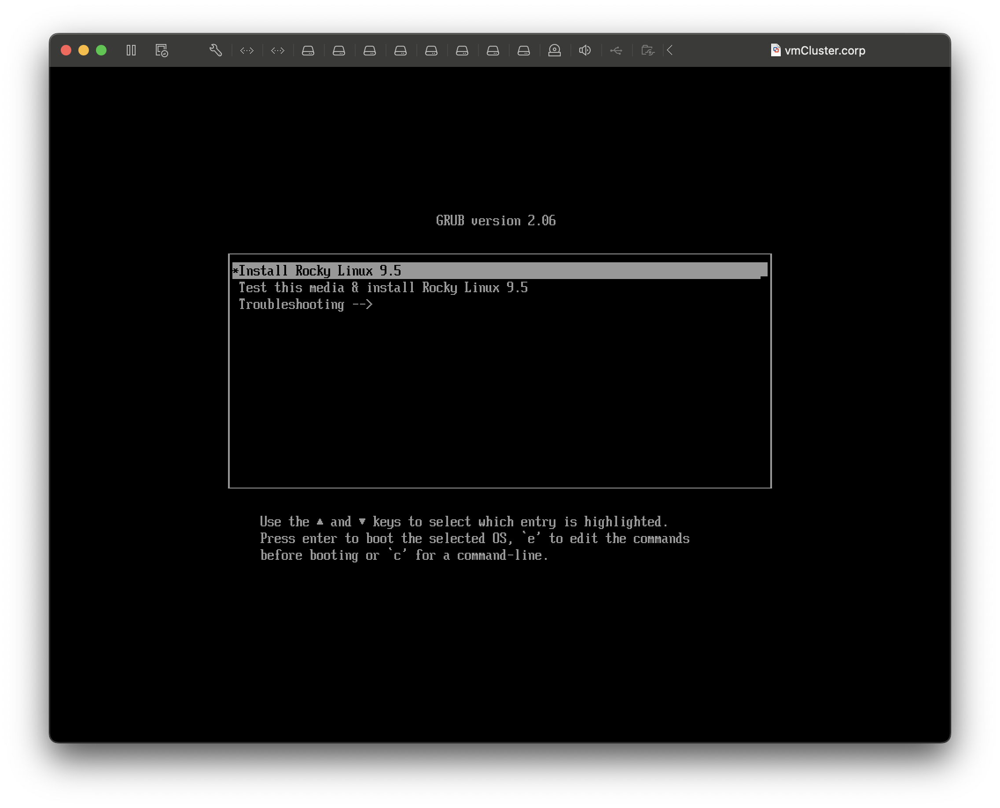
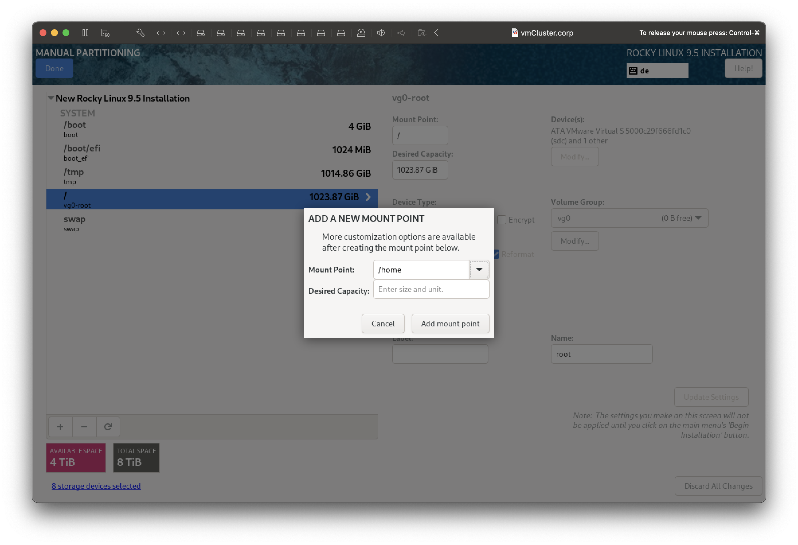

# Base Operation System Setup on Frontend Node

This recipe outlines the base operating system installation and setup on the frontend-node. All mentioned network related information shall be considered as exemplary and may be changed or adapted as needed.

Utilized network data:

| Property                  | Value             | Comment                      |
| ------------------------- | ----------------- | ---------------------------- |
| Public Hostname           | `vmCluster.corp`  |                              |
| Public Network            | `192.168.2.0`     |                              |
| Public Netmask            | `255.255.255.0`   | a.k.a. `/24`                 |
| Public Network Interface  | `192.168.2.123`   |                              |
| Public Gateway Address    | `192.168.2.1`     |                              |
| Public DNS Address        | `192.168.2.1`     |                              |
| Private Hostname          | `vmCluster.local` |                              |
| Private Network           | `172.16.79.0`     |                              |
| Private Netmask           | `255.255.255.0`   | a.k.a. `/24`                 |
| Private Network Interface | `172.16.79.1`     |                              |
| Private Gateway Address   | `172.16.79.1`     |                              |
| NTP Server Address        | various           | As sugested by the installer |

Download the latest Rocky Linux 9.5 boot image (https://download.rockylinux.org/pub/rocky/9/isos/x86_64/Rocky-9.5-x86_64-boot.iso), load it into the virtual CD/DVD drive, connect the drive and boot the frontend-node from the image file. Select `Install Rocky Linux 9.5` from the installer's menue:



## System Language and Keyboard Layout

Select desired installation and primary system language and click **Continue**.


Select, add, or modify the desired keyboard layout and click **Done**.


## Hostname and Network Settings

In the installer's main menue click on the **Network & Host Name** section. First set hostname to `vmCluster.corp` and click **Apply**.


Now configure the first network interface (here: `ens160`) for IPv4 as suggested and set IPv6 to `Link-Local Only`. After clicking on **Save** disconnect and reconnect the interface via the slide button.


After the first network interface is brought up, configure the second network interface (here: `ens192`) for IPv4, which will connect to the compute-nodes on the private subnet. Set IPv6 to `Link-Local Only`. After clicking on **Save** connect the interface using the slide button.

> [!WARNING]
>
> Not yet fully understood, which Gateway and DNS addresses shall apply here.


Return to installer's main menue by clicking on **Done**.

## Time and Date

In the installer's main menue click on the **Time & Date** section. Now that both network interfaces are operational, check the availability of an NTP time server by clicking on the cogwheel symbol to the right of the **Network Time** slide button. Either accept the suggested default server or make your own NTP server related settings. At least one NTP server should be working.


Return to installer's main menue by clicking on **Done**.

## Software Selection

In the installer's main menue click on the **Software Selection** section. Select the OS software to be installed on the frontend-node. The selection shown here is a suggestion. However, the following guides and recipes assume exactly this selection at minimum. 


Return to installer's main menue by clicking on **Done**.

## Installation Destination

Before beginning with the disk arrangement and partitioning let's have a look onto the desired configuration. There are 8 equal SATA hard disks available on the frontend-node and the idea is to find a partitioning scheme with a good balance between data redundancy and disk space extensibility.

The first two disks `/dev/sda` and `/dev/sdb` will be used to host the following logical volumes (or mount points). Notice that there is no Logical Volume Manager (LVM) activated on these volumes, because both `/boot/efi` and `/boot` do not cooperate upon boot with LVM. All volumes are protected against disk failure of one disk, but disk space extensibility is not given. However, this is not a problem, as these volumes are very rarely required to be changed in disk space. In most situations this will never happen.

| Mount Point         | `/boot/efi`        | `/boot`        | `swap`         | `/tmp`        |
| ------------------- | ------------------ | -------------- | -------------- | ------------- |
| LVM Volume Group    | none               | none           | none           | none          |
| RAID1 Array         | `/dev/md/boot_efi` | `/dev/md/boot` | `/dev/md/swap` | `/dev/md/tmp` |
| Physical Partitions | `sda4`+`sdb4`      | `sda2`+`sdb2`  | `sda3`+`sdb3`  | `sda1`+`sdb1` |
| Hard Drives         | `sda`+`sdb`        | `sda`+`sdb`    | `sda`+`sdb`    | `sda`+`sdb`   |

The root volume `/`will be hosted by the next two disks `/dev/sdc` and `/dev/sdd`. This volume is organized under volume group `vg0` and with a RAID1 array comprising two identical disks. RAID1 protects against failure of one disk and via the LVM volume group `vg0` more space can be added as needed, e.g. by adding two more disks, bundeling them as another RAID1 array, and adding this new array to the volume group `vg0`.

| Mount Point         | `/`             |
| ------------------- | --------------- |
| LVM Volume Group    | `/dev/vg0/root` |
| RAID1 Array         | `/dev/md/pv00`  |
| Physical Partitions | `sdc1`+`sdd1`   |
| Hard Drives         | `sdc`+`sdd`     |

The `/home` volume is different from above desribed other volumes. It can contain valuable user data and is sometimes vulnerable to running out of storage space. Therefore a RAID10 array comprising the last four disks and organized under a separate volume group `vg1` is suggested. RAID10 protects against one drive failure in each mirrored pair of disk drives. The availabe disk space can be extended in two ways:

- By adding an even number of new disks (min. 2) to the RAID10 array `/dev/md/pv01`,
- By adding any number of new disks in any organisation (as RAID or JBOD) to volume group `vg1`.

| Mount Point         | `/home`                     |
| ------------------- | --------------------------- |
| LVM Volume Group    | `/dev/vg1/home`             |
| RAID10 Array        | `/dev/md/pv01`              |
| Physical Partitions | `sde1`+`sdf1`+`sdg1`+`sdh1` |
| Hard Drives         | `sde`+`sdf`+`sdg`+`sdh`     |

### Drive Selection

Now jump into the **Installation Destination** section of the installer for setting up the disk arrangement and partitioning. Select all 8 disks from the **Local Standard Disks** list and launch the custom **Storage Configuration** wizard by clicking on **Custom** and on **Done**.


Select **Standard Partition** as partitioning scheme for all subsequent configuration steps. Create new mount points by clicking on the plus-sign in the lower left corner.


### Partition /boot/efi

The UEFI BIOS of the virtualized frontend-node requires a dedicated UEFI partition. In this example the `/boot/efi` partition shall be sized to 1024 MB and shall span over disks `sda` and `sdb` as RAID1 bundle.


Select **Device Type:** RAID, **RAID Level:** RAID1 and leave the automatic **File System:** selection. Click **Device(s): Modify...** and select the first two hard disks `sda` and `sdb`. 


Click on **Update Settings** to apply the `/boot/efi` settings.


### Partition /boot

The `/boot` partition typically contains the operating system kernel, which allows the system to boot Rocky Linux, along with files used during the bootstrap process. In most scenarios, a 4096 MB boot partition is adequate. In this example the `/boot` partition shall span over disks `sda` and `sdb` as RAID1 bundle.


Select **Device Type:** RAID, **RAID Level:** RAID1 and leave the automatic **File System:** selection. Click **Device(s): Modify...** and select the first two hard disks `sda` and `sdb`. 


Click on **Update Settings** to apply the `/boot` settings.


### Partition swap

In this exeample the `swap` partition shall be sized with 4096 MB and spanned over disk `sda` abd `sdb` as RAID1 bundle. It is a good practice to make the swap partition equal or larger than the actual RAM size of the frontend-node.


Select **Device Type:** RAID, **RAID Level:** RAID1 and leave the automatic **File System:** selection. Click **Device(s): Modify...** and select the first two hard disks `sda` and `sdb`. 


Click on **Update Settings** to apply the `swap` settings.


### Partition /tmp

A fully separate `/tmp` partition is not strictly required. However, as there is a lot of space available on disks `sda` and `sdb`, it is advantageous to use it for this purpose and to bundle it as RAID1. 


Select **Device Type:** RAID, **RAID Level:** RAID1 and leave the automatic **File System:** selection. Click **Device(s): Modify...** and select the first two hard disks `sda` and `sdb`. 


Click on **Update Settings** to apply the `/tmp` settings.


Now disks `sda` and `sdb` are fully consumed.

### Root-Partition

Continue with the root partition `/` which shall fully occupy both disks `sdc` and `sdd`.


Select **Device Type:** LVM and create a new volume group via **Volume Group: Create a new volume group**. Name the group as `vg0`, select disks `sdc` and `sdd`, set **RAID Level:** to RAID1, and leave the **Size policy:** as it is. Click on **Save** and on **Update Settings** to apply the `/` settings. 


Now disks `sdc` and `sdd` are fully consumed.


### Partition /home

Finally create the `home` partition over the remaining disks `sde` to `sdh` with a new LVM volume group and as RAID10 configuration.



Select **Device Type:** LVM and create a new volume group via **Volume Group: Create a new volume group**. Name the group as `vg1`, select disks `sde`, `sdf`, `sdg`, and`sdh`, set **RAID Level:** to RAID10, and leave the **Size policy:** as it is. Click on **Save** to apply the volume group settings. 


Correct the **Desired Capacity:** from 1024 GiB to 2048 GiB and click **Update Settings**.


Only a few MB are left over as free space indicating that all hard disks have been partitioned correctly. Click **Done** to start automatic check by the installer.


Accept changes listed by installer to return to the installer's main menue.


## User Settings

Create password for `root` and enabled root SSH login.


The creation of additional users can be skipped.

## Begin Installation

Click **Begin Installation** to launch the installation process.


Ready to reboot ...


Create first user...


Skip tour. Log out. Log in as root. Check for updates:

```bash
[root@vmCluster ~]# dnf update
Last metadata expiration check: 0:00:32 ago on Sun 12 Jan 2025 10:10:23 PM CET.
Dependencies resolved.
Nothing to do.
Complete!
[root@vmCluster ~]#
```

Deactivate SELinux in `/etc/selinux/config`:

```bash
...
SELINUX=disabled
...
```

## Post Installation steps

Intro...

### Delayed `/boot/efi` RAID1 Assembly and Resynchronization

As outlined in https://std.rocks/gnulinux_mdadm_uefi.html, it can happen that the UEFI writes data into the `efi` partition (e.g. during a firmware upgrade), in a critical moment, when the upstream `/boot/efi` RAID array is not yet assembled, because the bootloader is not RAID-aware by design. Such write operations to one half of an unassembled RAID1 array might or will corrupt the RAID array. This problem can be solved elegantly with the following steps:

- Prevent `/boot/efi` from being mounted automatically during boot by changing `/etc/fstab`,
- Prevent `/dev/md/boot_efi` from being assembled automatically during boot by changing `/etc/mdadm.conf`,
- Create a custom oneshot-`systemd` entry which delays RAID assembly, resynchronization, and volume mounting to an uncritical moment,
- Update `initramfs` with the above desribed changes.

Edit `/etc/fstab` and append option `noauto` to the `/boot/efi` entry:

```bash
...
UUID=AC09-5F6E /boot/efi vfat umask=0077,shortname=winnt,noauto 0 2
...
```

Edit `/etc/mdadm.conf` and disable automatic assembly for `/dev/md/boot_efi` by replacing the given mount point with `<ignore>`. Save or write down the volume UUID, as this information is required in the next step.

```bash
ARRAY <ignore> level=raid1 num-devices=2 UUID=bb78a5cf:dc0e3730:3e8338ab:44d1afa4
```

> [!IMPORTANT]
>
> The UUID given here is just an example. Use the UUID given in your system for the next step.

Create a new file `/usr/lib/systemd/system/mdadm-esp.service` with the following content and use the appropriate UUID:

```bash
# Based on https://std.rocks/gnulinux_mdadm_uefi.html
[Unit]
Description=Resync /boot/efi RAID1
DefaultDependencies=no
After=local-fs.target

[Service]
Type=oneshot
ExecStart=/sbin/mdadm -A /dev/md100 --uuid=bb78a5cf:dc0e3730:3e8338ab:44d1afa4 --update=resync
ExecStart=/bin/mount /boot/efi
RemainAfterExit=yes

[Install]
WantedBy=sysinit.target
```

Enable the oneshot-service with:

```bash
systemctl enable mdadm-esp.service
```

Finally update `initramfs` as our changes in `/etc/mdadm.conf` need to be included in this image as well:

```bash
dracut --force
```

Reboot the frontend-node and verify the result by inspecting the output of `df -h` and `/var/log/messages`:

```log
...
Jan 13 09:55:41 vmCluster systemd[1]: Starting Resync /boot/efi RAID1...
...
Jan 13 09:55:41 vmCluster kernel: md/raid1:md100: not clean -- starting background reconstruction
Jan 13 09:55:41 vmCluster kernel: md/raid1:md100: active with 2 out of 2 mirrors
Jan 13 09:55:41 vmCluster mdadm[1297]: mdadm: /dev/md100 has been started with 2 drives.
Jan 13 09:55:41 vmCluster kernel: md100: detected capacity change from 0 to 2099072
Jan 13 09:55:41 vmCluster kernel: md100:
Jan 13 09:55:41 vmCluster kernel: md: resync of RAID array md100
Jan 13 09:55:41 vmCluster kernel: md: md100: resync done.
...
Jan 13 09:55:41 vmCluster systemd[1]: Finished Resync /boot/efi RAID1.
...
```

### Create Additional User Accounts

This is a good moment to create additional user accounts. Such accounts can be created later at any time, but it is more convenient to have them created now.

```bash
# Create new user Jane Doe
useradd -c "Jane Doe" -g 100 janedoe
# Set password for new user
passwd janedoe
```

### Last Temporary Settings

Deactivate firewall on frontend-node temporarily with:

```bash
systemctl disable --now firewalld
```

### Final Checks

Check status of SELinux and firewall daemon:

```bash
[root@vmCluster ~]# 
[root@vmCluster ~]# sestatus 
SELinux status:                 disabled
[root@vmCluster ~]# 
[root@vmCluster ~]# systemctl status firewalld.service 
○ firewalld.service - firewalld - dynamic firewall daemon
     Loaded: loaded (/usr/lib/systemd/system/firewalld.service; disabled; preset: enabled)
     Active: inactive (dead)
       Docs: man:firewalld(1)
[root@vmCluster ~]# 
```

Continue with the next recipe [OpenHPC-Rocks Setup on Frontend Node](./03-OpenHPC-Rocks-Setup-on-Frontend-Node.md).
