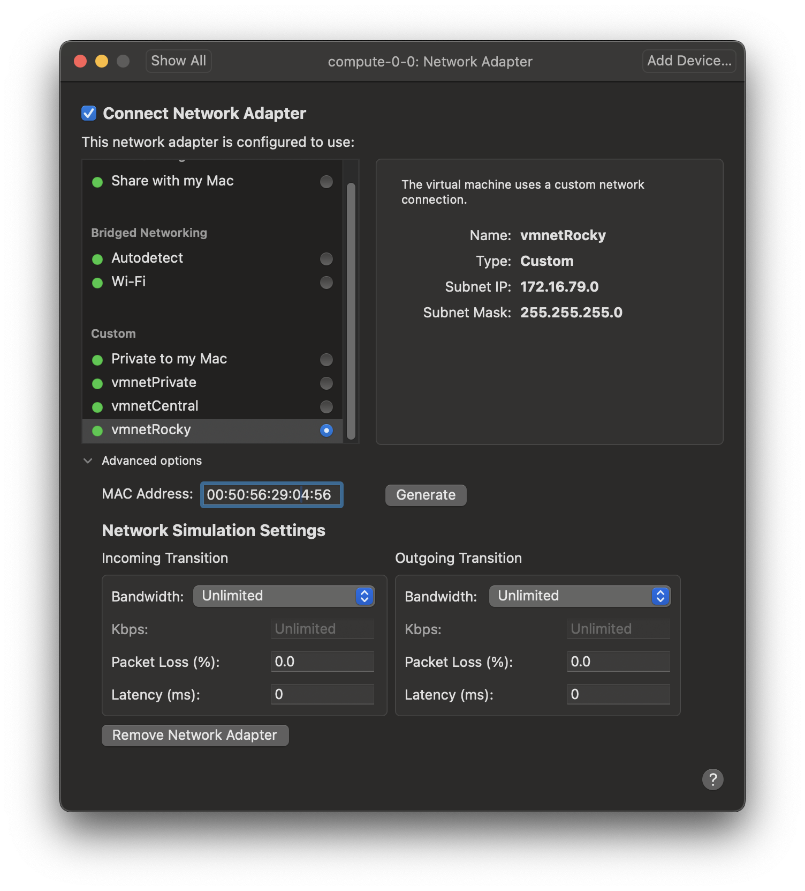

# Virtualized Compute-Nodes

This recipe outlines how to setup a virtual compute-node with VMware Fusion. This description can be skipped for real-world compute-nodes.

Create a new custom virtual machine for **Rocky Linux 64-bit** with a new virtual disk and call it `compute-0-0` following the Rocksclusters definition (http://central-7-0-x86-64.rocksclusters.org/roll-documentation/base/7.0/install-compute-nodes.html). The first digit indicates the cabinet number and the second digit the node number. Open the settings of the virtualized compute-node and apply the following changes from the otherwise given default settings.

Deactivate Default Applications.

Select two processor cores with 6144 MB RAM.

Deactivate 3D graphics support.

Connect Network Adapter to virtualized private network and generate a new MAC address. Save this address for later.

Modify present harddisk to the following settings.

Remove CD/DVD Drive, Sound Card and USB Controller. Disable Isolation.

Apply advanced settings:

These steps create a new machine `compute-0-0` in VMware's Virtual Machine Library. Activate the current machine in the list (just one click) and select from the VMware menue `Virtual Machine` -> `Power On to Firmware`. This opens a simplified version of a classic legacy BIOS menue.

> [!TIP]
>
> VMware blocks the computer mouse while working interactively in text-mode consoles. Hit Control+Command to release the mouse.

Jump to the `Boot` section and change order of devices as shown below. Notice that keyboard map in this mode is not your local map, but `en_US`.

Jump to `Exit` section and hit `Exit Saving Changes`. The virtual machine reboots, but cannot be detected by the frontend-node yet. Select select from the VMware menue `Virtual Machine` -> `Shutdown` to switch off the compute-node ignoring the warning.

Repeat the sequence for other virtual compute-nodes, e.g. `compute-0-1`, `compute-0-2`, etc. and continue with re recipe [OpenHPC-Rocks Compute-Node Integration](./05-OpenHPC-Rocks-Compute-Node-Integration.md).