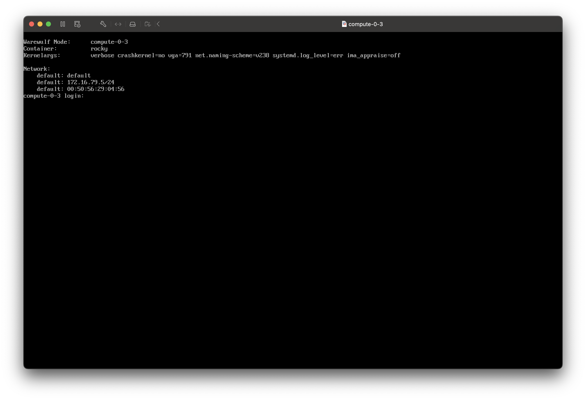

# OpenHPC-Rocks Compute-Node Integration

This recipe describes how to register and deploy compute-nodes on the virtual cluster environment, described in the preceding recipes.

## Set Common Profile Options

Common and crosssectional compute-node properties are collected in a so-called node profile. OpenHPC provides the node profile `default` which applies to all nodes. The commands in this section utilize parameters `Private Netmask`, `Private Gateway Address`, and `Public DNS Address`. You may set kernel parameters for compute-nodes to your needs (https://www.kernel.org/doc/html/v5.14/admin-guide/kernel-parameters.html) or use the default ones.

```bash
# Defaults values for profile default
wwctl profile set -y default --container rocky
wwctl profile set -y default --netmask=255.255.255.0 --gateway=172.16.79.1
wwctl profile set -y default --netdev=default --nettagadd=DNS=192.168.2.1
wwctl profile set -y default --kernelargs="verbose crashkernel=no vga=791 net.naming-scheme=v238 systemd.log_level=err ima_appraise=off"
```

For this recipe it is essential, that the compute-node properties **number-of-cpu-sockets**, **number-of-cores-per-cpu-socket** and **number-of-threads-per-core** are defined in node profile `default`. Individual compute-node properties (superseeding the default ones) can be set at a later time, when the compute nodes are defined.

```bash
wwctl profile set -y default --tagadd Sockets=1
wwctl profile set -y default --tagadd CoresPerSocket=2
wwctl profile set -y default --tagadd ThreadsPerCore=1
```

> [!NOTE]
>
> The preceding settings for `Sockets`, `CoresPerSocket`, and `ThreadsPerCore` are just examples for the perimeter of this recipe collection with virtualized compute-nodes. Adapt values for real compute-cluster deployments.

## Configure Local Disk for /tmp and swap Usage

Although Warewulf provisioning does not require a compute-node with a harddisk, it is often useful to have one disk installed on each node for swapping and temporary disk space. Depending on the actual disk type the device name (here: `/dev/sda` for a SATA disk) may vary. This step requires the package `ignition` to be installed in the compute-node container.

Create swap partition with size of 4096 MB on `/dev/sda` with the following command. Upon reboot the partition will not be wiped.

```bash
wwctl profile set -y default --diskname /dev/sda --partname swap --partsize=4096 --partcreate --partnumber 1 --fsname swap --fsformat swap --fspath swap --diskwipe=false --fswipe=false
```

Create a second partition for the remainder of `/dev/sda` and have it mounted to `/tmp`. Upon each reboot the partition will be wiped.

```bash
wwctl profile set -y default --diskname /dev/sda --partname tmp --partcreate --partnumber 2 --fsname tmp --fsformat xfs --fspath /tmp --diskwipe=true --fswipe=true
```

See https://warewulf.org/docs/main/contents/disks.html for more information. In case of errors check `systemd` log on compute-node with:

```bash
journalctl -u ignition-ww4-disks.service
```

> [!TIP]
>
> Maybe it's wise to create a third partition with limited space for all logging data in `/var/log/`.

## Compute Node Registration

Unlike Rocksclusters, OpenHPC+Warewulf require pre-registration of compute-nodes with name, IP-address, and MAC-address before deployment. There is no such convenience-tool like `insert-ethers`.

> [!IMPORTANT]
>
> Warewulf provides the command line option `--discoverable`  for automatic reception of MAC-addresses and update of the Warewulf database. However, the author of this recipe was not able to bring this feature to work within the context of VMware-virtualization.

Obtain the MAC-addresses of the desired compute-nodes and select free IP-addresses from the defined DHCP-address range in `/etc/warewulf/warewulf.conf`:

```bash
...
dhcp:
  enabled: true
  template: static					# use static IP assignment
  range start: 172.16.79.2	# next possible private IP
  range end: 172.16.79.254	# last possible private IP
...
```

In this example, the following four (virtualized) compute-nodes shall be registered:

```bash
wwctl node add --ipaddr 172.16.79.2 --hwaddr=00:50:56:37:86:5A  compute-0-0
wwctl node add --ipaddr 172.16.79.3 --hwaddr=00:50:56:39:25:36  compute-0-1
wwctl node add --ipaddr 172.16.79.4 --hwaddr=00:50:56:25:AB:C0  compute-0-2
wwctl node add --ipaddr 172.16.79.5 --hwaddr=00:50:56:29:04:56  compute-0-3
```

> [!WARNING]
>
> There is no consistency check for duplicate IP-addresses or hostnames with `wwctl`.

If necessary, update individual compute-node properties, deviating from the default properties in node profile `default`, e.g. if one of the compute nodes has a different number of CPU-sockets or CPU-cores.

```bash
# Override default CoresPerSocket setting for compute-0-3
wwctl node set -y compute-0-3 --tagadd CoresPerSocket=4
# Remove individual CoresPerSocket setting and return to default from node profile
wwctl node set -y compute-0-3 --tagdel CoresPerSocket
```

Update all image overlays, configure Warewulf and reconfigure Slurm:

```bash
wwctl overlay build
wwctl configure -a
scontrol reconfigure
```

## Compute Node Deployment

Switch-on one compute-node after the other and have a look onto the displayed messages. The following image shows a virtualized compute-note trying a network boot by launching a DHCP request:


Compute-node receives IP-address from frontend-node's DHCP server:


Compute-node configures its `net0` network device. For whatever reason this step somtimes takes longer and sometimes runs faster - maybe a VMware artefact.


Annoyingly, sometimes this VMware message window pops up - just cancel it ...


... and accept the follow-up dialog window.


Warewulf provides compute-node with kernel image, container image, ...


... and with all required image overlays.


Compute-node boots from supplied image and overlays ...


... continues booting ...


... starts services ...


... and is finally online.



Slurm automatically detects and enables the compute-node if configured following the recipe [OpenHPC-Rocks Setup on Frontend Node](./03-OpenHPC-Rocks-Setup-on-Frontend-Node.md). In this example we see four compute nodes `compute-0-0` to `compute-0-3`, each with one CPU-socket and two CPU-cores, resulting in 8 available CPUs.

```bash
[root@vmCluster ~]# sinfo
PARTITION AVAIL  TIMELIMIT  NODES  STATE NODELIST
main*        up   infinite      4   idle compute-0-[0-3]
[root@vmCluster ~]# sinfo -o "%C"
CPUS(A/I/O/T)
0/8/0/8
[root@vmCluster ~]#
```

## Troubleshooting

### DHCP No Free Leases

**Symptom:** Compute-node does not receive boot image and DHCP-server complains about "no free leases" in `/var/log/messages`:

```log
Jan 14 20:28:10 vmCluster dhcpd[5465]: DHCPDISCOVER from 00:50:56:37:86:5a via ens192: network 172.16.79.0/24: no free leases
```

**Solution:** Possible IP-mismatch between DHCP-Range in `/etc/warewulf/warewulf.conf` and specified `--ipaddr` during `wwctl node add ...`.

### Compute-Node Kernel Panic with virtualized Compute-Nodes

This may be a VMware inconvenience, which is caused by to little RAM settings on the compute-node. The author of this recipe recommends the following settings:


This recipe concludes the series of recipes for setting up a virtualized distributed compute cluster environment using VMware. See also [Common Cluster Administration Tasks](./06-Common-Cluster-Administration-Tasks.md).