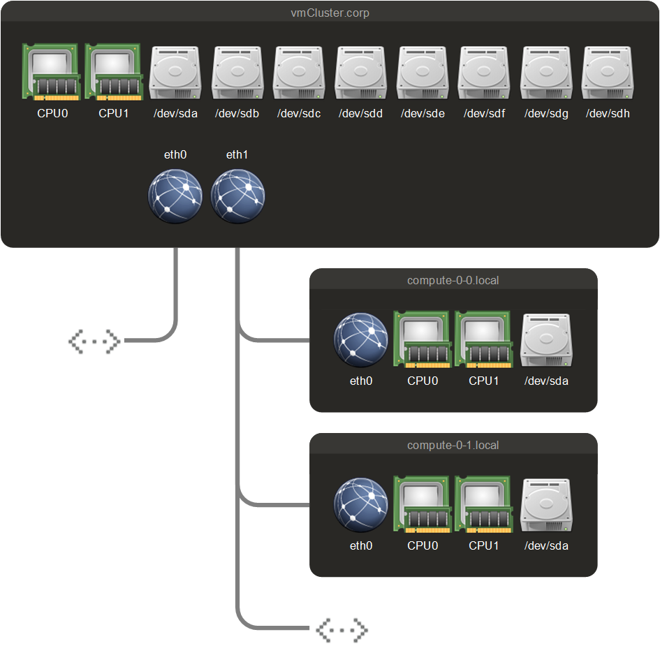

# OpenHPC-Rocks Installation and Administration Guides

Last Update: 2025-02-04. This is work in progress.

## Preamble

OpenHPC-Rocks is an attempt to create guides and recipes to mimic the cluster environment and user experience provided by [ROCKS](http://www.rocksclusters.org):tm:, a classic and now outdated open-source Linux cluster distribution project, with the help of the [OpenHPC community project](https://openhpc.community), hosted by The Linux Foundation®.

OpenHPC-Rocks is not a Linux distribution nor does it provide any significant software packages. Instead, it is an approach to document (from a half-way experienced Linux adminstrator's perspective) all necessary steps to set up a compute cluster environment, suitable for small and medium sized teams. Advanced topics like access to baseboard management controllers (BMCs) on remote compute nodes and integration of InfiniBand (IB) or Omni-Path (OPA) environments are currently not yet covered.

All guides, recipes or task sequences described herein are tested on a virtualized cluster environment using VMware Fusion. It is suggested to exercise the cluster setup procedure using such a virtualized cluster, in which snapshots can be generated which allow the roll-back of unsuccessful administration trials. 

## Assumptions

The following simple cluster architecture is assumed:

The required network switch is not separately shown here. Notice that unlike in ROCKS:tm: the first Ethernet interface (e.g. `eth0`) is exposed to the public and the second Ethernet interface (e.g. `eth1`) connectes to the compute nodes on the private subnet.

## Differences between OpenHPC-Rocks and ROCKS:tm:

Notice some conceptional technical differences between OpenHPC-Rocks and ROCKS:tm: which impact the boundaries to which OpenHPC-Rocks is able to mimic ROCKS:tm::

| Property                         | ROCKS:tm: | OpenHPC                   |
| -------------------------------- | -------------------- | ------------------------- |
| Provisioning of compute nodes    | Stateful             | Stateless with overlays   |
| Compute node primary boot source | PXE, then local disk | PXE-provided boot image   |
| Compute node RAM size            | No lower limit       | At least 4 GB (on VMware) |

OpenHPC compute nodes need to accommodate the PXE-supplied boot image in a RAM disk. The image is typically larger than 1GB and generally reduces available RAM on compute nodes generally.

## Guides

1. [Virtualized Cluster Environment](./01-Virtualized-Cluster-Environment.md)
2. [Base Operation System Setup on Frontend Node](./02-Base-Operation-System-Setup-on-Frontend-Node.md)
3. [OpenHPC-Rocks Setup on Frontend Node](./03-OpenHPC-Rocks-Setup-on-Frontend-Node.md)
4. [Virtualized Compute-Nodes](./04-Virtualized-Compute-Nodes.md)
5. [OpenHPC-Rocks Compute-Node Integration](./05-OpenHPC-Rocks-Compute-Node-Integration.md)
6. [Common Cluster Administration Tasks](./06-Common-Cluster-Administration-Tasks.md)
7. [CST-2025 Cluster Installation](./07-CST-Cluster-Installation.md)

## Licenses

Copyright © 2025, Kritzel Kratzel, kritzel.kratzel@gmx.de. All rights reserved.

This documentation is licensed under the Creative Commons Attribution 4.0 International License. To view a copy of this license, visit http://creativecommons.org/licenses/by/4.0.

The Rocks Logo and the name ROCKS:tm: are registered trademarks with the United States Patent and Trademark Office and other patent and trademark offices.
